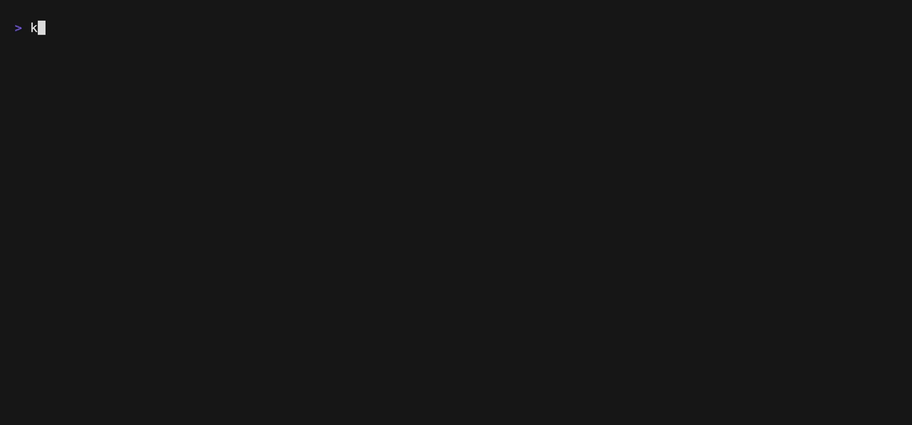

# kl

<p>
    <a href="https://github.com/robinovitch61/kl/releases"></a>
    <a href="https://pkg.go.dev/github.com/robinovitch61/kl?tab=doc"></a>
    <a href="https://github.com/robinovitch61/kl/actions"></a>
</p>

An interactive Kubernetes log viewer for your terminal.



* View logs across multiple containers, pods, namespaces, and clusters
* Select containers interactively or auto-select by pattern matching against names, labels, and more
* See cluster changes in real time
* Navigate logs from multiple containers interleaved by timestamp
* Search logs by exact string or regex pattern. Show or hide surrounding context
* Zoom in and flip through single formatted logs one by one
* Archive and share: save logs to a local file or copy a log to your clipboard

Comparable to:

* [kubectl logs](https://kubernetes.io/docs/reference/kubectl/generated/kubectl_logs/) supercharged
* [k9s](https://k9scli.io/) but specializing in logs
* [stern](https://github.com/stern/stern) & [kail](https://github.com/boz/kail) but multi-cluster and with an interactive
  interface

## Usage

[Install](#Installation) and run `kl` in a terminal. See `kl --help` for all options.

Examples:

```shell
# Use the current kubernetes context, defaulting to `default`
kl

# Use context `my-context`, all namespaces
kl --context my-context -A

# Use contexts `my-context` & `other-context`, namespaces `default` & `other-ns` in each context
kl --context my-context,other-context -n default,other-ns

# Auto-select containers with a pod owner (e.g. deployment) containing the word `nginx`
kl --mown nginx

# Auto-select containers with the exact name `my-container`, limited to 10 containers
kl --mc "^my-container$" --limit 10

# Auto-select containers that have labels app=flask and either tier=stage or tier=prod
kl -l 'app=flask,tier in (stage, prod)'

# Ignore containers with the exact name of `my-sidecar`
kl --ic "^my-sidecar$"

# Start focused on logs, ordered by timestamp descending, showing logs from 10 minutes ago onwards
kl --mc "^my-container$" -d --logs-view --since 10m
```

Press `?` in any view to see keyboard shortcuts specific to the current view and across the application.

| Key     | Action                                          |
|---------|-------------------------------------------------|
| ↓/j     | down one line                                   |
| ↑/k     | up one line                                     |
| d       | down half page                                  |
| u       | up half page                                    |
| f       | down full page                                  |
| b       | up full page                                    |
| g       | go to top (will follow logs if descending)      |
| G       | go to bottom (will follow logs if ascending)    |
| l       | focus on logs view                              |
| L       | focus on logs view in fullscreen                |
| enter   | zoom in to single log view for selected log     |
| esc     | back to all logs view when viewing single log   |
| s       | focus on container selection view               |
| S       | focus on container selection view in fullscreen |
| F       | toggle fullscreen                               |
| /       | edit exact match filter                         |
| r       | edit regex filter                               |
| enter   | when filtering, apply filter                    |
| esc     | discard applied filter                          |
| n       | next filter match                               |
| N       | previous filter match                           |
| x       | toggle showing only the logs matching filter    |
| w       | toggle line wrap                                |
| ←/→/h/l | pan left/right when not wrapped                 |
| o       | reverse timestamp ordering                      |
| p       | pause/resume log stream                         |
| t       | change timestamp format                         |
| c       | change container name format                    |
| 0-9     | change time from which logs begin               |
| ctrl+s  | save focused view to local file                 |
| ctrl+y  | in single log view, copy to clipboard           |
| ?       | show/hide help                                  |

## Installation

The following installation options are available:

```shell
# homebrew
brew install robinovitch61/tap/kl

# upgrade using homebrew
brew update && brew upgrade kl

# nix-shell
# ensure NUR is accessible (https://github.com/nix-community/NUR)
nix-shell -p nur.repos.robinovitch61.kl

# nix flakes
# ensure flake support is enabled (https://nixos.wiki/wiki/Flakes#Enable_flakes_temporarily)
nix run github:robinovitch61/nur-packages#kl

# arch linux
# PKGBUILD available at https://aur.archlinux.org/packages/kl-bin
yay -S kl-bin

# with go (https://go.dev/doc/install)
go install github.com/robinovitch61/kl@latest

# windows with winget
winget install robinovitch61.kl

# windows with scoop
scoop bucket add robinovitch61 https://github.com/robinovitch61/scoop-bucket
scoop install kl

# windows with chocolatey
choco install kl
```

You can also download [prebuilt releases](https://github.com/robinovitch61/kl/releases) and move the unpacked
binary to somewhere in your `PATH`.

## Development

`kl` is written with tools from [Charm](https://charm.sh/).

[Feature requests and bug reports are welcome](https://github.com/robinovitch61/kl/issues/new/choose).

Running the app with the environment variable `KL_DEBUG=1` will create or append to a `kl.log` file in your current
directory with debug logs.

To manually build the project:

```shell
git clone git@github.com:robinovitch61/kl.git
cd kl
go build  # outputs ./kl executable
```

Run an example flask + postgres + nginx setup in a local [k3d](https://k3d.io/) cluster for testing locally:

```sh
k3d cluster create test
k3d cluster create test2
kubectl --context k3d-test apply -f ./dev/deploy.yaml
kubectl --context k3d-test2 create namespace otherns
kubectl --context k3d-test2 apply -f ./dev/deploy.yaml -n otherns

# view both clusters and all namespaces in kl
kl --context k3d-test,k3d-test2 -A

# access the application's webpage
kubectl --context k3d-test2 -n otherns port-forward services/frontend-service 8080:80
open http://localhost:8080

# browser console one-liner to click button every second to generate logs
setInterval(() => { document.getElementsByTagName("button")[0].click(); }, 1000);

# or make requests directly to flask from the terminal
kubectl --context k3d-test2 port-forward services/flask-service 5000:5000
curl http://localhost:5000/status
```

## Manually Specify the `kl` Version at Build Time

If necessary, you can manually specify the output of `kl --version` at build time as follows:

```shell
go build -ldflags "-X github.com/robinovitch61/kl/cmd.Version=vX.Y.Z"
```

In this case, you're responsible for ensuring the specified version matches what is being built.

